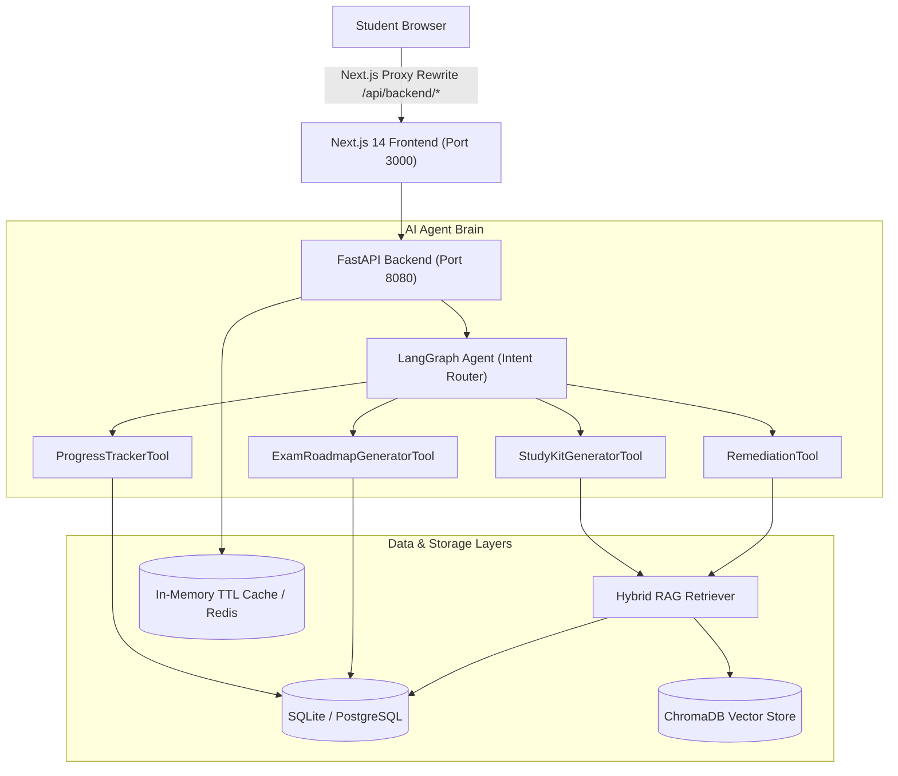

# VAIBHAV — Autonomous AI Tutor & Personalized Learning Path Generator


---

## 🏗️ Architecture Overview



---

## 🌟 Feature Breakdown

### 1. Syllabus Ingestion & Knowledge Graph
- **Multi-Format Extraction:** Processes `.pdf`, `.docx`, and `.txt` syllabus files with structure-preserving heading extraction.
- **PII & Noise Cleaning:** Normalizes whitespace, scrubs sensitive email/phone headers, and segments text into ~500-token chunks with overlap.
- **Dual Storage Indexing:** Stores topic hierarchies in SQLite/PostgreSQL for keyword lookups and vector embeddings in ChromaDB for semantic search.

### 2. AI Next Topic Recommendation (< 500ms Response)
- **4-Priority Recommendation Queue:**
  1. Struggling topics with active remediation triggers.
  2. In-progress topics currently below 80% mastery.
  3. First unstudied topic in natural syllabus sequence order.
  4. Lowest mastery score topic for review when all topics are mastered.
- **Caching Layer:** Uses 30-second TTL caching with automatic invalidation on progress updates.

### 3. Grounded Study Kit Studio (RAG-Driven)
- **Quiz Evaluation:** Multiple-choice questions with answer key self-checking, detailed explanations, and source chunk citations.
- **3D Flashcards:** Interactive 3D flip card decks with front concepts, back answers, and source citations.
- **Grounded Summaries:** Structured Markdown notes capturing intuition, key definitions, and critical takeaways.
- **Analytical Problem Guides:** Step-by-step analytical reasoning walkthroughs grounded in your actual course material.
- **Zero Hallucination Guarantee:** Uses a 3-tier LLM fallback chain (`OpenAI GPT-4o` → `Ollama` → `MockLLM`) with strict source citation badges.

### 4. Progress Tracking & Adaptive Remediation
- **Exponential Moving Average (EMA):** Updates mastery score dynamically: `new_mastery = 0.6 × score + 0.4 × old_mastery`.
- **Struggle Signal Detection:** Detects two consecutive quiz scores under 60% and triggers targeted remediation.
- **Analogy-Based Breakdown:** Generates real-world analogies, simplified concept breakdowns, and confidence check questions.

### 5. Exam Mode & Dynamic Deadline Pacing
- **Mastery-Weighted Scheduling:**
  - Weak topics (`mastery < 50%`) → 3 hours/day (double review sessions).
  - Medium topics (`50% ≤ mastery < 80%`) → 2 hours/day.
  - Mastered topics (`mastery ≥ 80%`) → 1.5 hours light review.
- **100% Coverage Guarantee:** Schedules all units strictly before the exam date with automatic re-pacing when behind schedule.

---

## 🛠️ Tech Stack

| Layer | Technology | Rationale |
|---|---|---|
| **Frontend** | Next.js 14 (App Router), TypeScript, TailwindCSS, Lucide Icons | Server-side rendering, glassmorphism UI, built-in CORS proxy rewrite |
| **Backend** | FastAPI, Uvicorn, Pydantic v2, SQLAlchemy 2.0 | Async-native, high throughput, strict schema validation |
| **AI & Orchestration** | LangGraph, LangChain, Hybrid RAG Retriever | State-machine agent architecture with vector + keyword search |
| **Databases** | SQLite (local) / PostgreSQL (Docker), ChromaDB | Relational topic tree + vector embeddings for semantic search |
| **Caching & Auth** | In-Memory TTL Cache / Redis, passlib, python-jose | Microsecond recommendation responses |

---

## 🚀 Quickstart Guide

### Prerequisites
- Python 3.10+
- Node.js 18+ & npm
- Docker Compose (optional for containerized deployment)

### 1. Local Development Setup (Windows / macOS / Linux)

#### Backend Setup
```bash
# Navigate to backend directory
cd backend

# Create virtual environment (optional but recommended)
python -m venv venv
# On Windows: venv\Scripts\activate
# On Mac/Linux: source venv/bin/activate

# Install dependencies
pip install -r requirements.txt

# Run backend server (from project root)
cd ..
python run_server.py
```
*Backend API docs available at `http://127.0.0.1:8080/api/v1/docs`.*

#### Frontend Setup
```bash
# Navigate to frontend directory
cd frontend

# Install dependencies
npm install

# Run Next.js development server
npm run dev
```
*Frontend app available at `http://localhost:3000`.*

---

### 2. Docker Setup

```bash
# Build and launch all services with Docker Compose
docker compose up --build
```

---

## 🧪 Running Unit Tests

```bash
# Run pytest test suite
python -m pytest backend/tests
```

---

## 📑 API Endpoints Summary

- `POST /api/v1/syllabus/upload` — Ingest PDF/DOCX/TXT syllabus & build graph
- `GET /api/v1/syllabus/{document_id}/graph` — Retrieve topic hierarchy (supports `{id}` or `latest`)
- `GET /api/v1/progress/next-topic` — Get AI-recommended next topic
- `POST /api/v1/progress/update` — Record quiz attempt, update mastery & check struggle
- `GET /api/v1/progress/mastery` — Get full mastery dashboard
- `POST /api/v1/study-kit/generate` — Generate quizzes, flashcards, summaries, problem guides
- `POST /api/v1/remediation/trigger` — Trigger adaptive concept breakdown & analogies
- `POST /api/v1/exam-mode/setup` — Configure target exam date & generate paced roadmap
- `GET /api/v1/exam-mode/roadmap` — Fetch active day-by-day exam roadmap
- `PATCH /api/v1/exam-mode/toggle` — Toggle Exam Mode on/off
